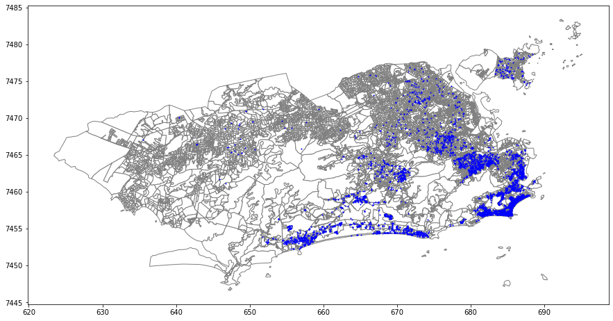

# Geopandas
Curso introdutório sobre a biblioteca Geopandas(veja: https://github.com/geopandas/geopandas). Com ela você pode fazer 
análise de dados georeferenciados bem como aplicar modelos de machine learning (para previsões de preços de imóveis, por exemplo).

Exemplo do que foi visto, mapa censitário da cidade de rio janeiro:



# Pré-requisitos
* ```jupyter notebook 6.0.3 ou superior``` - ambiente computacional comum na comunidade de ciência de dados e aprendizado de máquina para vizualização de resultados
em pequenos pedaços de código chamados de **células** ou **notebooks**.
* ```geopanas 0.7.0 ou superior``` - biblioteca em python que contém ferramentas para tratamento 
de dados georeferênciados (veja o que o é georeferenciamento: encurtador.com.br/jqwB6).
* ```matplotlib 3.2.1 ou superior ``` - biblioteca em python para visualização de gráficos e dados em geral.
* ```pandas 1.0.4``` - biblioteca para manipulação de dados de várias extensões( .csv, .txt, .xls, etc.)
* ```folium 0.11.0 ou superior``` - biblioteca em python para vizualização de mapas de forma interativa

# Licença

código aberto, pois é apenas para intuito de aprendizagem.

# Autoria e contribuições

Faz parte de um curso da plataforma alura ministrada pelo instrutor Rodrigo Fernando Dias(https://bityli.com/KJ8ey) onde eu 
coloco alguns comentários neste código para me guiar futuramente.
